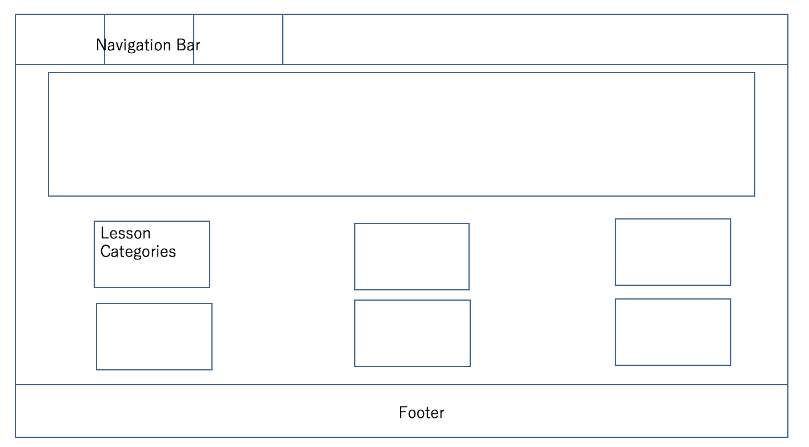

# midterm

# Topic: What is the subject at hand? Which broader field(s) does this site apply to?

###### This is a Language learning website for English speakers who are planning to travel to Japan and want to learn basic Japanese before traveling. Nowadays, with the technological development and globalization, more and more people start to travel around the world. It became cheaper and easier for people to go abroad. However, travelers often face problem of language barriers. There are many countries which do not speak English, or any other languages other than the local ones. Travelers may face difficulties in variety of daily life situations such as eating food, getting on a transportation, staying at a hotel, and greeting people etc. While they do not intend to master a language, they may want to understand and be able to use basic language that they will need to survive during traveling, which can make their traveling experience more enjoyable and memorable.

# Problem: What is the problem you're trying to solve?
###### There have been increasing number of tourists are coming in to Japan in recent years. Yet, Japanese people are not good at speaking English at all. In such unique cultural Travelers may face difficulties in dealing with daily life situations. Especially, for western people, Japanese culture and customs may be very unique and understanding those cultural aspects of the country will be an very interesting experience for travelers.

# Target Audience: Who is your target audience? Describe in detail
## User Stories
### User Story 1: A 31 years old American man, who has no Japanese learning background at all, is planning on his first visit to Japan. He will be visiting Japan in 3 days and needs a last minute cramming study to understand basic Japanese vocab and sentences.

### User Story 2: A 22 years old Chinese girl (who speaks English), who has no Japanese learning background, but had a Japanese friend back in undergrad, and knows very basic Japanese words. She hopes to travel to Japan in coming April. She will be seeing her Japanese friend in Tokyo, and she wants to surprise her by improving a little bit of her Japanese. She has 3 months till the travel. She is very excited about seeing cherry blossoms.

### User Story 3: A five-member Indonesian family( who speaks English) is planning to travel to Japan in coming May. They have already planned their travel: starting from Tokyo, Nagasaki, Mt.Fuji, Hakone and Kyoto. They have no Japanese background, and a little worried if they will be able to communicate with local people.

### User Story 4: A 16 yeas old Brazilian boy’s dream is to travel to Japan. He is not planning to travel to Japan yet, but he loves Japan and he likes to imagine places he wants to visit in the future. He is not formally studying Japanese but knows some vocabulary from watching Anime and reading manga. He is eager to visit Japan someday, and learn useful vocabulary.

# Strategy
## Site Objectives:
###### ・Users will be able to understand and use basic vocabulary and sentences during traveling by studying last minute
###### ・User will be able to enjoy the trip and have no problem in doing what they want during travel. It should make their traveling experience more smooth and enjoyable.

# Success Metrics:
###### ・Pre assessment: Since our target users are the very beginner with no background of Japanese language, we assume that they have no knowledge in Japanese language.
###### ・Formative assessment: We will provide a quiz for each sections, and user will be tested for their knowledge.
###### ・The number of visits on the website is another success metrics.

# Scope: Functional and Content Specifications
###### This website is targeted for people with no background knowledge in Japanese language, and hoping to learn some useful vocabulary and sentences for traveling purpose in short amount of time. Thus, the contents are mainly based on travel related languages. The contents are Baiscs/Greetings/Directions/Shopping/Numbers/Dining out. Quiz section will help learner tests their knowledge and understanding.

# Structure: Interaction design and information architecture

# Skeleton: Interface, navigation, information design (You'll provide wireframes here)

